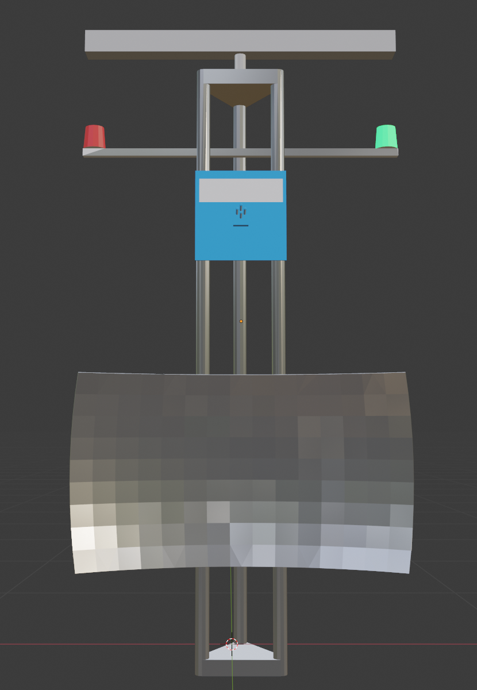

# Mast Model in Simulation


<p align="center">
  
</p>


By the end of this tutorial, you should have a simluated mast in gazebo so that you can start working with it to test out various computer vision tasks. This is currently a work in progress so don't get salty and ask Drew is you have questions. 

## Step 1: Register the mast model with gazebo

Our mast model (currently in `./mission9-2022/mast`) needs to be placed in the folder `/px4_sitl/PX4-Autopilot/Tools/sitl_gazebo/models/` so that gazebo recognizes it. Run the following command **as root** from the base ./mission9-2022 directory.

```
$ sudo -i                       
$ cp -r ./mast /px4_sitl/PX4-Autopilot/Tools/sitl_gazebo/models/        
```

Sweet! Now gazebo should know where to find the mast model. You can test that this worked by starting up gazebo and checking under the "insert" tab if you can insert a "mast" model into the world. Just click on "mast" and click somewhere on the ground plane to place a mast model.

```
$ cd /px4_sitl/PX4-Autopilot                 
$ make px4_sitl gazebo        
```

## Step 2: Register a custom world

The next step is to register a custom world for gazebo so that we don't have to keep creating masts every time we want to test our algoirthms. 

Similar to the above step, our new world description (currently in `./mission9-2022/worlds/simple_mast.world`) needs to be placed in the folder `/px4_sitl/PX4-Autopilot/Tools/sitl_gazebo/worlds/` so that gazebo recognizes it. Run the following command **as root** from the base ./mission9-2022 directory.

```                   
$ cp -r ./worlds/simple_mast.world /px4_sitl/PX4-Autopilot/Tools/sitl_gazebo/worlds/        
```

Next, we need to tell the px4 startup script that this is a valid world. To do this, open the file located at `/px4_sitl/PX4-Autopilot/platforms/posix/cmake/sitl_target.cmale` and **edit line 85** so that the list between the () contains our world "simple_mast". Then make sure to save the file!

## Step 3: Run our custom world
Awesome! now it's time to run our new world! Note that there are three underscores in the bottom command. 

```
$ cd /px4_sitl/PX4-Autopilot                 
$ make px4_sitl gazebo___simple_mast
```


Happy Coding!
